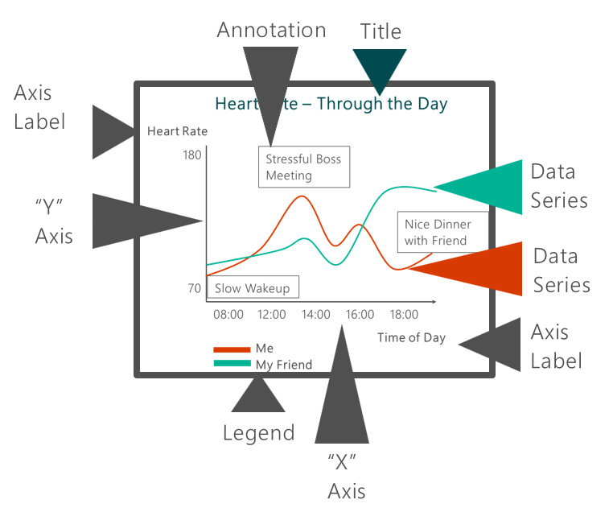

## Data Visualization: A Practical Approach for Absolute Beginners
## Visual Literacy
### Visualizations are Everywhere
If you look around at any point during a normal day, you can see data visualizations all around you. 
The battery indicator on a mobile phone is a great example. The spedometer in a car is another way to visualize the 
speed of a vehical beyond just a numeric value.

Visualizations provide a different way for your brain to process the data in a way that utilizes visual recognition 
- something our human brains are optimized for.
We're going to start this course by looking at differnt visualizations around us and 
how they are a natural part of how we process information. We'll then introduce simple visualizations we can create 
to help translate data into tools for insight generation.

##### Four pillars
 1. Analyze data.
  - Using Visualizations to gain insight
    - Understanding - So we analyze data, we try to understand data,
2. Communicate it out
  - Passing a message to others
    - Connection - We have to connect the abstract world of data with the real stuff of life.
3. Monitoring
 - tracking information about performance - For e.g. we have a lot of servers that require uptime and in those servers, we want to make sure that everything's ticking along.
  
4. Planning
  - forecast or predict or potentially preempt any negative outcomes
  - Forsight
  
  
When we get into making data visualizations you'll see that what we're trying to do is we're trying to make a sum of
all the little parts and points of data that we will compile. And that's to make it delicious for users,
make it delicious and exciting for yourself.
And much like assembling a burger, what we'll find is these individual little points or these moments in time or
these customers or these partners or these purchases, all these things come together into a single whole that excites end users,
that makes it interesting and understandable by others.

#### Visualizations are Delicious

Visualizations can be about everything. And if you like to look at other luminaries in the field who have talked about this,
we are going to put this in the notes after this video. You should check out the work by Edward Tufte, Hans Rosling, especially if you
want to get excited about how to present data. Amanda Cox from the New York Times, Steven Few, Colin Ware, and others.
And there's a whole plethora of people who are into this and who do it and who can help us along as we start to develop these skills.
And as well, it's not just those people creating it, but it's also consuming it. Everybody consumes these data
that we make, these data visualizations. And this is just an example from the world economic forum.
So, they have created what are called knowledge graphs or network graphs to understand even just categorical data. So this is about innovation. All the different piece parts that relate to innovation. And it's exciting to me.
Hopefully, it's exciting to you. And from here, we're going to start actually building and creating and practicing the art
and science of data visualization.

To get inspired about what's possible with Data Visualization, it's great to see examples - Power BI's Data Stories Gallery is an excellent place to start: https://community.powerbi.com/t5/Data-Stories-Gallery/bd-p/DataStoriesGallery

For further reading about luminaries in Visualization, explore the following:

Edward Tufte - https://www.edwardtufte.com/tufte/
Hans Rosling - https://en.wikipedia.org/wiki/Hans_Rosling
Amanda Cox - https://www.nytimes.com/by/amanda-cox
Stephen Few - http://perceptualedge.com/about.php
Colin Ware - http://ccom.unh.edu/vislab/colin_ware.html
There are also a variety of visualizations on interesting topics here: https://toplink.weforum.org/knowledge/explore

### Visualizations Fundamentals
Data Behind your Visuals

Data - As the term implies, there is raw data behind the visualizations we're talking about here. Software interprets the data into the visualizations that we create. This can be small amounts of data, or massive Big Data systems. It can also come in many different formats. Let's begin with a simple explanation.

#### Friendly Statistics
Every living human has a beating heart. If you count your heart beats, you're collecting data by simply counting. That's referred to as your pulse. How many times does your heart beat in a minute? That's your BPM (Beats Per Minute). Over a period of time, like five minutes, or a half hour - you can take the BPM over the time period to find an average BPM per period.

The math involved is fundamental, but the data and the visualizations that come from this simple math is transformative to how we can do something profound, like monitor patient health.

#### Ingredients of a Chart

1. Title - It's great to have a title. It's good to understand what this chart is about and give people that context.
2. Data Series. You can't have a chart, a data visualization without data.
3. Annotations are great. - Annotations can help you tell a story in that visualization itself. 
4. Axes. - There's the X and Y axis, those axes are just where your data is plotted and labeled.
5. Canvas - the space in which your data can reside.
6. Labels - context of what is that axis.
7. Legends. - They give you some more context. Without that, it would have been hard to understand that there were two people,
perhaps, that you're charting with the heart rate.

 

####  Visual Processing Stages

Our brain does a lot of things without us knowing it, and until we take a top-down thinkers' approach to what's happening,
we have sensory input that's coming at us. And in data visualizations, that's happening all the time.
We have to make sure that we're using color properly, we're using motion, we're using labeling, and all that stuff,
because when we're approached with a data visualization, it's easy for us to make some quick snap judgments
without us even thinking about it. And in order to do that, we have to master these components of let's say form or color like we talked about. 
There's also position and motion in data, and all these things can come together to tell a story for your data visualization.
And just being aware of the simple fact that there's stuff that happens in our brain even before us knowing it, gives us that impetus to put that little extra effort into the data visualization, into the chart, to make sure that this chart here tell us the story that we want it to, that we're not using a red bar chart to indicate perhaps something bad or a green bar chart to indicate that there is money behind it, but understanding that all of those stuff is important and we're going to start practicing and building the proper stuff that
makes up these visualizations that are impactful and leveraging these things correctly as we go along.

========================================================================================================================================
## Visual Analysis
### Visuals for comparing and Relating
#### Comparing and Relating
It's easy to think about different ways to comapre or relate different bits of data. It's one of the most immediate ways data visualizations can have impact. When you look at data visually, the comparisons leap out and become very obvious.

#### Simple Comparisions
There are three very simple charts to start with. Bar, Column and Pie charts. They are a quick easy way to show comparisons between data points. In these examples, you can see quickly which daily expense had the highest price. while these are quick and easy to produce, you should consider your users, and which might make the most sense.

Remember that when using a pie chart, it's sometimes misleading because the filled in circle implies a total spend. So, while you can see values related to each other this way, there is implication that the sum of the parts equals some whole value, which isn't stated. If you hadn't seen the column or bar chart below, would you know how much was spent on these three items by looking at the pie chart?

#### Comparisons Over Time

Time is one of the most important elements in analysis. Understanding where things have been, where things are going. And we've already seen a little bit of this with our heart rate chart right?
That data set isn't just one single point in time. And it's a critical part of our analysis.

#### Complex Comparison Types
The graphical elements for complex chart types can get complicated to build, but can have tremendous value in simplifying how quickly you can see patterns and significant sections of data. For example, you may find data points well outside of normal ranges, or clusters of datapoints. There are a few useful visualizations that can help with this:

Maps - using geographical maps is a good way to look at datapoints over geographies. For example, average temperatures by region or populations of various cities.
Heatmaps - heatmaps let you look at a table of data with visualizations showing value relations right on top of the data itself. It's a quick way to see outlier data.
Scatter Plots - Sometimes called a scattergraphy, these charts plot data points over two axis and use color coded points or dots to illustrate the data.
Bubble Charts - Simiar to scatter plots, bubbles use different size circles to indicate relative size of the data points.

### Visuals for Interacting and Analyzing
#### Interacting and Analyzing data
#### Pivot Basics

Beyond, comparisons with these visualizations, there's also the ability for people to interact with data sets.
So you can poke at it, you can click on it, you can filter it, summarize it, aggregate it. And one of the primary ways that people do that, is through what are called Pivot Tables. And in this case we have household expenditures as the data set
and what these pivot tables do is they take data and they kind of aggregate it up, summarize it according to
those categories you see, those four there, and then allow you to sort of filter or interact with data in new ways.
And so, it's really like trying to interpret and understand by turning data in different ways,summarizing it in a new way, turning it around, and trying to make sense of it, and really Pivot Tables are one of the best ways to do that.

#### Visual Analysis with Calculations

You're to have imagine
a single bar or
a column from a bar chart or a column chart,
that was just kind of bent over.
That's what you're seeing here is a bent bar perhaps,
that is almost towards the target.
And that's what we see with that black line there.
And this is a gauge, or
sometimes called like half of
a donut chart or a gauge chart.
And really, it's just measuring actuals against target,
and you'll hear that often in business.
And that's just to say you have a number and you want to
see how it's related to something
that you planned out in advance.
And in this case, looks like we're almost
meeting it, maybe that's 120.
There's not enough context to tell the whole story here.
But, in another example,
we can show exactly this.
So there's sales here on what's called an area chart.
And an area chart is
simply kind of like one of those line charts,
but it has the color filled in,
so it's just to show you the volume really of
sales over time is
useful with a lot of different data points.
And in this case, it's showing
you that, okay, in aggregate,
there's $340 thousand-ish that were sold,
but the red indicates that
perhaps that's not quite to target.
And you'll notice in the number below,
it does say that the goal is about 20 percent
more than where they're at today with sales.
And it's another way to do it,
so these are kind of both examples
of calculating your targets,
calculating data points and
putting those into your visuals
to make it that much more complex
and useful for the purpose at hand,
in which case this is probably using it to drive
sales and to drive understanding
of where they're at today,
and what actions they need to take
to meet those goals in the future.

#### Complex Analysis

When you're visualizing and analyzing data and you
want to portray a really complex story,
it can get pretty complex
in terms of the visualizations you use.
And you know, the temptation
is to add everything into a chart to
make it kind of stuffed with data and stuff with points.
But if you're gonna to do that you have to
prepare users and help
them understand what they're looking at.
And in this case, it would be hard to put this chart
up and have somebody immediately
interpret it, understand it.
But in very specific scenarios
where people have been trained to use this,
what's called a Pareto chart.
It makes much more sense.
So, in Supply Chain Manufacturing,
there's a lot of defect analysis that goes on.
For example, and they look at what parts are kind of
broken or what things are
breaking in let's say like vehicle manufacturing.
And what parts do we focus on
to eliminate defects and have the biggest bang
for a buck when it comes to fixing
processes. And that's what these are used for.
So, if you'll notice the big red column there,
is really like where most of the defects are happening.
And the line you see on top of that column,
go to the top 200% is
indicating that well most
of the defects are coming from this one place.
And as you go to 100% and understand this is
a part the whole analysis kind of
like a Pie chart, right?
That you can only go up to 100%.
As every other defect is added on,
it increases that percentage only so much more.
So, the point of Prios is to add a quick glance say,
"Hey what should I focus on?
What do I need to do?".
Without that prior training on how to
interpret these various items, it can be tough.
So, just as as a word of advice.
As we're doing these visualizations,
keeping it simple isn't just for you,
it isn't just for the clarity of message,
it's so that you don't have to
prepare people to understand and
listen to something similar to what I just described with
a Pareto charts and you'll be good.

