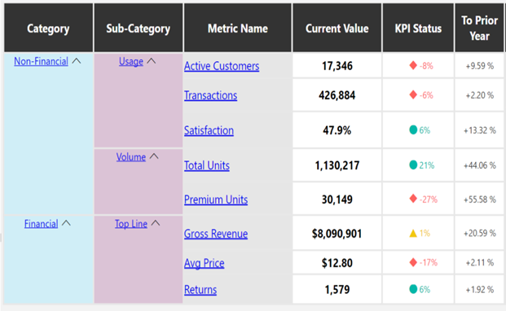

### Visualization for Business
### Business Visualization

Businesses live and breath by communicating data visualizations all the time. Here at Microsoft not a day goes by without various reports, scorecards, and charts flying through email and presentations to communicate business status and other information. In this lesson you'll start to see how to create these visualizations for business use.

#### Overview of Business Visualizations
You may see visualizations around you for personal use like health monitoring or the current status of your car, or the location of your train. Visualizations in a business context can be extremely useful in communicating complex information in simple and efficient ways. In this lesson we're going to look at the importance of visualizations in business, and a few simple ways they are used.

When we do visualization of business there are really four artifacts that we end up creating as data visualization experts. 
1. Dashboards. And when you think of dashboards you may immediately go to maybe the dashboard in your car. And that's to show you an aggregate of information like is my car healthy? How fast am I going? And how many miles do I have left in my tank of gas? And all that stuff can be accessed in that one portal, and that's the idea of dashboards is that you can run your business out of a dashboard. 
Dashboard - Dashboards are used to track performance, a dashboard is a compilation of various visualizations to summarize business information. They are usually specific to a parituclar role-based audience, they are sometimes interactive using filters, and there are always multiple visualizations related to each other in the same dashboard.

2. Scorecards is maybe even more specific to performance. For these key metrics, how am I doing? Red, yellow, green? Is there something I need to be aware of right now? Something flashing at me? There's a lot's of different ways that you can scorecard, but it's all to do with performance. And those are used to track things like in business, your revenue targets your customer satisfaction, and all that. And I think can be used inside of a dashboard.
Scorecard - Scorecards are specific visualizations to display performance. They track things like revenue targets of customer satisfaction - any thing that can be specifically measured against a target. Scorecards are often presented as one part of a dashboard. Scorecards often illustrate KPIs (key performance indicators).

3. Next, maybe in less complex scenarios you basically do an <b> analytic </b>  report. And the idea is that you create this report as visualization that business users will access maybe more than once and it refreshes with live data, but it doesn't have to be this one stop shop of everything happening in the business. 
Analytic Reports - Analytic reports are pre-designed analytic views based on data. These can be basic or complex charts, and can be refreshed against the latest data to provide a current timely report.

4. And last but not least for sure, are just basic analysis. When you're creating an analysis for a problem at hand, and that might be a one-off and that's okay, and that's necessary for the thing that you're working on. And that might be, let's figure out how we're doing on sales today, or in other example in business, let's figure out where our customer's pain points are and then from that analysis we could then take some specific action in our business to change behavior to drive results.
Analysis - This is free-form reporting that could be a one-time use report or group of charts used to answer a particular business question.

#### Analysis
When doing Analysis you're working with a specific problem at hand. Maybe it's a one off report or a one off chart that you're making and you're trying to solve something.

#### Reporting
Unlike our basic analysis where we were looking at a specific problem, reports are kind of made to be a little bit more of an aggregation or a summary of things happening. It's not necessarily something that's hyper interactive or has a lot of intelligence built into it. It's just a summary of an aggregation of your data.

#### Scorecarding
The idea is as you tack on some more intelligence, and bake that into the report itself, and make it an indication of performance rather than just a report, you're entering the Scorecard territory. And in this, you also see these red, yellow, green stoplights, you see trend lines, and there's just more built into it.

And the components of a Scorecard are not too much more complicated than just a basic report.
But the idea is you have these metrics or what are called KPI's, Key Performance Indicators, that form the basis of this chart.
And so you have your metric values, and you have your trend perhaps on that side, that's a nice addition, but it's not necessary.
And just provide some more ability to interact and understand how things are going. And you have your details, and the performance indicators maybe the most important part of the Scorecard. You have your stoplight. Are we going well, or are things going well?
Do we have to stop and slow down? Do we have to accelerate? And that's the idea of these. And this is imperfect, right?
So, there's a few other things that you want like scale. What's a scale of goodness? How are those thresholds determined?
Where is your legend? And all these things like even a title would be helpful to put in here, but that's a given, you already know that.
So this is what a Scorecard is. And I think the biggest part is just understand that it's about performance and how things are going,
and indicating that and you got the basics.

##### Key Performance Indicators
A common item on a scorecard is a KPI or Key Performance Indicator. These are specific pieces of data that have defined ranges for success. They're useful to provide an at-a-glance measure of the health of a paricular measurement. A scorecard full of KPIs that uses a known color scheme, like red means bad and green means good, can make it very easy to determine the business health at a point in time.

You can specify the ranges and which color indicators should be used in Microsoft Excel using Icon Sets under the Conditional Formatting option.

In this example, there is a KPI column showing business health at a glance - it's a visual indication for each row to see if the business is on target, or not.

#### Dashboarding

Moving from analysis, to reports, to a scorecards, maybe the most complex that we can build, the artifacts that we make for businesses are dashboards. This one stop shop like we mentioned. And then this is an industry analysis dashboard. And there's a whole lot going on, but you can imagine that, perhaps, somebody who's trying to do some competitive analysis, who has a responsibility in a business, already has some context in play. And this dashboard is made for her or him, and they would sit down and look at this and understand where things at in their business. Where are things going? Where are things wrong that I need to pay attention to or is everything okay and I can go back to my work at hand? And that's really the purpose of dashboards. And in this case, there's a whole lot going on in this one. There's over eight charts. And is it a scorecard? Is it a dashboard or a port? I think that in the end, the scorecards or reports can form part of a dashboard. And in this case, it's lacking something, perhaps, like a title and some more context. The lines can get blurry, but the idea is if you keep these kind of four things in your mind, you have analyses, you have reports, scorecards, and you have dashboards, you can at least distinguish what am I being asked to create? Is it something more like the dashboard I saw before or it's just for a specific person or is it for our business? Is it for a specific problem at hand? And having this framework will help you navigate those.

##### Designing Dashboards
When you set out to build a dashboard, one of the problems that you could face is, oh no, I have a blank canvas in front of me. I have this space to put these visualizations in. And not knowing how to layout things and design things can be tough. So, I think I'd like to give you just a couple tips and pointers on how to get past that blank canvas problem in dashboarding. So, this is what I call the 4-pack, the idea being you have these four chart elements that are making up a dashboard and they hopefully are related in some way in a fashion. And then you also have some contextual things around it. 

The idea is I love a dashboard to have a title. I think that's really important. 
And also some other metadata, like when was it created? Or what version is this? And anything else, any other contextual things that you need to know in order for somebody to look at this and be like, "I know what this is talking about." So just take four different visualizations that are hopefully somewhat related and stick them in that canvas. Put some data around it. Good to go. Another example. Here's another nice 4-pack. Then, you could do what I call an 8-Pack, what I saw there before, when I asked you if it was a scorecard or a dashboard report. Just provide some context around that and then you'll be good to go as well, but I still prefer that 4-pack. 8-pack might give you more some raise statistics to the top and more at the bottom. And you can do many variations thereof. So, I'll give you one last one, and it's called the marquee. The idea is you have this hero graphic, this graphic at the center of things that you really want people to understand and interpret. And you have some supporting materials around it at the bottom. And this one is very common, I think you'll see it sometimes with maps and other things too. But marquee is a great place to start. So, these aren't the only variations. You'll see everything and anything out there in terms of formatting, so I think the first thing to do is just to start experimenting and if you get stuck, just choose one of these formats and roll with it.

### Business context for Visualization
Once you've learned how to create data visualizations that communicate the business point you're trying to communicate, there are a lot of ways this information can be shared to give context to the message in your visualization. In this lesson you'll see a few examples of setting that business context.

#### Data Economics
One of the most important things to know about building visualizations for business, is that it costs businesses money to make these things. So, they're not free, it costs your time. It costs compute time to run, and they have varying levels of cost when you make them. And these are for artifacts that you're familiar with and they have varying levels of cost. Of course this can change. Your analysis could get way in-depth and require you to do a lot of work, but really at the end of the day on average I'd say, dashboards are the most expensive artifact to create and create well. Then you have your scorecards. They're complex. They have intelligence built into them, but your basic analysis or analytic reports aren't going to cost as much. But in terms of demand, now demand can be different, because demand can depend a lot on the context of your new business and the maturity of your business thereof. So, your business may require you to make a lot of analysis and reports in the beginning, and as you get more mature and more complex in your business structure, more dashboards are going to be needed in order to run your business. So, it's important to keep in mind this cost structure and supply and demand in mind as you go about building visualizations for business.

Data requests come from an environment of supply and demand - businesses need insights, and data developers and analysts create useful artifacts for this purpose. We'll extend this concept of data microeconomics into your lab for this module, as you'll be considering the demand-side in the creation of scorecard-like elements for a dashboard very soon.

#### Visual Storytelling
In business when your presenting visualizations, it's often in the context of an actual presentation where you've put together maybe a slide or two about the data at hand. And you've spent some more kind of putting into this nice visual presentation and these artifacts,
but really you're there to tell a story. 

And the idea is not to just look and point at graphs and pick out specific data points, but give context. 
>> For example: So, begin with something like, on our big launch date, we really commanded most of the conversations on the internet
around lemonade stands, around lemonade businesses. And let me give you an example of one particular comment that was really great. And zooming out from that, let's look at the comparisons between different channels and look at that and give ourselves a pat at the back for doing such a job well done. 

So, in business this is definitely important. This is a skill that can be developed by everybody. Reference: If you'd like to learn more about storytelling in a business context, check out Ben Olsen's course on edx.org called Analytics Storytelling for Impact https://www.edx.org/course/analytics-storytelling-for-impact

#### Visual Distribution
>> And when you're building these visualizations
and sharing them out in your business,
it's not that they're just
sort of hanging out on their own.
They have their own context in which they were
asked for, in which you present them in.
And they can come in many different formats.
So, perhaps your boss asked you for
a report out and you said OK,
well send it to me in email.
And that's where oftentimes, you'll find like
the requests you have come in for visualizations.
And that's one of
the primary ways that we go
about distributing our visualizations.
But another, of course, is portals or websites.
And although, this is terrible perhaps it's
AlligatorsandWineEnthusiasts.com.
You're part of this alligators
and wine enthusiasts business.
And they want to go there and see how things are going or
they want to go there to see
the latest most exciting post.
And websites in your business portals will
often surface your visualizations for
you and be the place that you need to distribute it.
And lastly of course, we've already
talked about presentations,
but that is of course one of the places that you'll go
to share out and communicate your visualizations.

##### Business Context
It's important in business to know your audience. This is the first step in deciding how to frame your business visualizations. Here are a few things to consider:

- Are you talking to a group where you can explain yourself?
- Are you sending your visualizations around in email?
- Are you sharing to a broad group, or just a couple of people?
- Is your information confidential or business sensitive?
- Are the people you're sharing the information with allowed to see the data?
- Consider these questions carefuly before you distribute any visualizations, and check with your manager to see if they have any concerns about what you're building and how it's going to be shared.

