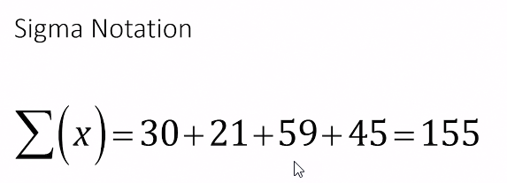
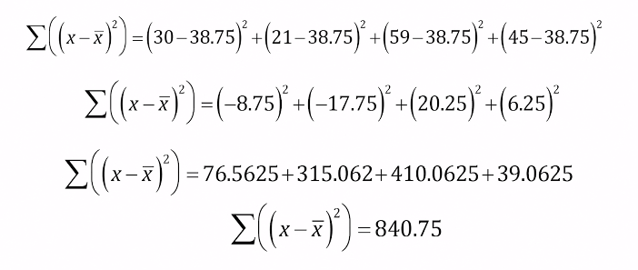
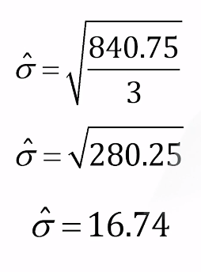

### Course Overview

This course has six modules.

1. Introduction to Data and Variables: In this module, you'll look at different types of data, unpack variables as a concept, 
and explore the implications these have for how we look at data in business and in the world at large. You'll also learn 
the basics of mathematical notation that pertains to data analysis.

2. Summarizing Data with Distributions and Graphs: In this module, you'll leverage common visualization techniques such as 
histograms, pie charts, bar graphs, etc., and the underlying tables that go with them in order to understand the essential 
measurements and math behind distributions. Additional topics covered include skewness and various kinds of non-normality.

3. Summary Statistics: In this module, you'll learn to identify the right summary statistic for variables. You'll also learn 
how to compute those summary statistics using both stock Excel functions and nesting basic Excel functions. Topics covered 
include mode, mean, median, standard deviation, interquartile range, proportions, and crosstabs.

4. Business Statistics: In this module, you'll learn about KPIs (key performance indicators) in a business context, as well as 
the different types of KPI you might see from business, financial, sales, marketing, and IT analysts.

5. Introduction to Inferential Math and Forecasting: In this module, you'll explore and apply the principles of inferential 
statistics. You'll also be introduced to the basics of forecasting in Excel for data analysis.

6. Final Exam and Challenge Labs: At the very end of the course, you'll take a 30-question, multiple-choice Final Exam and 
complete two Challenge Labs.

### Introduction
There are two main goals for this course. Now, in many ways data analysis and statistics can be taught in sort of a cookie cutter fashion, where you don't really understand what you're doing, you just do it You just kinda plug and play some things together. You don't really know what's going on. That is not my goal for you in this course. I am hoping that you will come out of this course with some actual understanding, not just how to do things, but what they mean and why, so you begin to build that reasoning and that skill set that you could apply in many contexts. But in addition to that, I also want you to be able to use it. I want you to be able to use some basic statistical tools, I want you to be able to implement those in a program like Excel, so that you can actually do the nuts and bolts of data analysis. And then, of course, this will give you a foundation not only for doing statistics and data work, but also give you a base to build on so that you can take other courses and build your skills further. So this is what we're going to do in this course. We're going to learn some basics of data analysis, you're going to learn how to use it, and you're going to be able to have a foundation to learn more, so I hope you're excited, as I am.

### Math and Data
##### Example Analysis
In this video I want to walk through an example data analysis. Rather than thinking about data analyses as abstractions I want to give you a concrete example of the kinds of ways we might begin to tell a story with data. Now anytime you get data I like to think of it as a gift or package with some sort of discovery or lesson hiding inside just waiting for us to go in and unpack it. And once you build this basic skillset you'll be able to open datasets and find all kinds of lessons and stories that are hidden from view. Things that other people can't see that you're gonna be able to get the ability to see. So I wanna walk through an example from my own scientific research so you can kind of see how that process might look and maybe catch a little bit of the enthusiasm for telling stories with data. So in my own research I've done scientific research on how personality functions because I'm a psychologist by training. So the question I asked from this data was what happens to personality as we age and I was really interested in how our human tendency to feel remorse changes with age. One question we might ask is whether people become more emotionally mature and we might think that feeling remorse is a sign of maturity so one question we might have of data is does this tendency grow with time, grow with age as we might imagine that it does. So here is some data that I actually collected. I had a survey, 400 people filled it out and I gave people a measure of guilt-proneness. You don't really need to know how this works, but essentially a higher score means you're more sensitive, you're more likely to feel remorse. We asked people their age and I just looked to see if there was some sort of correlation or link between these two things. Now you don't know how to do these analyses yet, but that is going to give you the foundation for understanding this example. So I've graphed the data here. Now you can see on the bottom of the screen you have age and going up on the screen you have guilt. And just looking at this data it kind of looks like there's some sort of relationship here. You can just kind of see that as people age it looks like the guilt scores are going up. Just kind of looks just like maybe there's some sort of relationship here. This is the first step of data analysis is just to get a good look at the relationships in your sample. Now in this case we can also do another statistical analysis, one that you might get a chance to learn in this course. In this case we're going to do something called a regression analysis and that lets me draw a trend line. And we look at this trend line, we do see that there is an upward relationship. Look at that red line. As age increases people's personalities do tend to become more sensitive to feeling remorse. And so here now we have unpacked a story about how personality works. Indeed people's personalities do appear to change with age. Isn't that interesting? We can actually look and see this effect of maturing with age in just a simple correlation plot like this. I hope this gives you kind of a little bit of excitement about analyzing data. There are stories to be told whatever the variables you're interested in. You might not be interested in remorse and age. You might be interested in all kinds of different things. But regardless there are stories in the data to be told. Insights like this one about any topic you might be interested in and as long as you have data we can find the story. So let's go ahead and get into the fundamentals of data analysis so we can begin to unpack stories in your data.

##### Tidy Data
Read the row and column

### Types of Data
Next we're going to talk about four common types of data that you might see in data sets. 

- The first is string. Now string seems like an odd name, but string just means text. And there's lot of times we're going to encounter text in databases. These might be comments on a website or notes that might be entered. I'm mentioning this because you're gonna see these but they might not be easy to analyze. Often text requires reading and reading is not what statistics is all about. Keep an eye out for text variables in the data that you look at. I will just mention though, sometimes text is really used to represent categories. Things like sex or classification or various things like that. In that case, it's not really text then and then we might be able to analyze it. 

- Another common type of data format is dates. We often keep track of the dates and times that things happen. Keep an eye out for these. They can come in many different formats and in tools like Excel, we can actually change those formats around to work for us in a way that looks nice. Now I mentioned this too in part because at the end of our course, we're going to get a chance to use date data to make projections into the future. So with statistics, we can actually guess the future. We have a little bit of a crystal ball. Just to note, sometimes these do or don't include the time and so dates can come in different formats like that. 

- The most common data type that we're gonna come across though is numeric. This represents numbers or quantities of things. We're always counting things all the time. These could be number of products sold or projected sales or incidents resolved. All different kinds of things like that. This is gonna be the heart and soul of our data analysis because we can do all kinds of statistical analyses on these. One side note, again sometimes we use numbers to represent categories. Things like sex, we could use numbers to code those. Like ones and twos for example. But then it's not really numeric. 

- Last by not least, some of the numeric variables you're gonna analyze are currency. You might have quantity of money. So there's not really anything special about these other than just to point out we can do all the same data analyses with money that we can with other tools. So there we go. Four different types of data that you might see in the data that you analyze. 

##### Categorical Data
Next, we're going to talk about different levels of measurement. Now, these are different ways that we can represent information and data, and I want to talk through two of them. 

- The first I'm going to talk through is called nominal. This is a type of data you're really familiar with; it's just categories. So, for instance, we might look at the color of something or maybe your favorite food. This is a common type of data where we just have people, or items, or objects, or whatever grouped into categories. And the only information it contains is the category itself.

- The next type of data that we see is called ordinal. It's essentially the same thing, but this is now your categories have an order to them. This is actually a lot more common than you might think. For example, if we ask somebody a question, "How happy are you with your job," and gave them three answers, "Not at all," "Somewhat" or "Very," this is actually an ordinal variable. Why, because they've only responded with one of these three categories. But they do have an order to them. Clearly, somewhat is more than not at all, and clearly, very is more than somewhat. But we don't actually have some sort of unit of measure here. I don't know how big the gap is between those. There's not some sort of consistence space or measure to them. So these are going to contain categories with order and an ordinal variable. How is this data represented in the data that you might analyze? Often, it's represented with numbers. For instance, maybe we've coded them one, two, and three in that last example. Or they might be represented in text. Either way, they're very common variable types that you are going to come across a lot in the data that you analyze. 

##### Numeric Data
Next, we're gonna talk about different types of numeric data. Let me ask you a question: is four dollars twice as much money as two dollars? Think about that for a moment. Yes, the answer is yes, right? I mean, clearly four is twice as much as two. Let me ask you a different question: is 40 degrees Celsius twice as much heat as 20 degrees Celsius? You might be tempted to say yes to that, but the actual answer is no, it's not twice as much heat. The number 40 is twice as much as 20 but if you were to convert that into Fahrenheit, or any other unit of temperature, you would find that it is not twice, so, what's going on? There's numbers, but these two situations seem to be different. The answer is that not all numeric data is created equal. In this case, for money, there is what we call an absolute zero. That is, zero is the smallest value you can have. When you hit zero you are out of that thing. With temperature, the zero is arbitrary. We just picked some point along the scale and called it zero. These are very different types of numeric data and you're gonna come across both of them in the data you analyze. When we have an arbitrary zero, we call it an interval scale. It is something like temperature or it might be any numeric rating system like if you rate something on a one to five scale. Zero there doesn't have any meaning at all. If there's an absolute zero, typically when we're counting things or have some quantity, we call it a ratio scale. Only when we have an absolute zero can you make comparisons like, "This is twice as much as that," when you have those numbers. Two very important distinctions for two very important different types of numeric data. 

##### Levels of Measurement Summary
So now I wanna take the last two lessons and merge them together and see if we can draw some insights about the types of data that we're going to encounter. Specifically I wanna make the claim to you that the four different levels of measurement we've just discussed nominal, ordinal, interval and ratio form a sort of hierarchy, so I'm gonna walk through this. 
- At the base level we have nominal this is really the variable with the least amount of information to it, it just has categories to it, there's no order, it has the least amount of information. 
- If we think about this as a sort of information hierarchy ordinal variables just have a little bit more information. There's categories but now there is an ordering to them. So if you think about which way you may want to store or collect or analyze data, clearly the ordinal variable has more information. There's more information, there's probably more story we can tell. 
- Beyond that we have that interval numeric data, this is data that is measured in numbers but with some sort of arbitrary zero. Clearly more information, now I've got some sort of scale, that I'm measuring with, some sort of unit of measure and I can use numbers for it. - - Last but not least I have that ratio level of measurement. Where I have measured in numbers and I've got an absolute zero. All else being equal if you can measure something at that ratio level, you probably should because you're getting the most information represented. 

### Formula Sneak Peek
Next I wanna give us a sneak peek about where we're gonna be going next, specifically we're gonna now pivot a little bit and learn about statistical formulas. This is gonna be a notation for giving you step by step instructions about how to analyze data. Some people might be a little intimidated by formulas, but really it's just a recipe and I wanna teach you how to read and follow the recipe. As long as we can follow the steps we can perform the calculations. So we're gonna have some step by step instructions that's gonna walk us through how to analyze our data and then we can find any summary statistic of interest, key performance indicators for our business, anything we might need. Here's an example. This is probably the... In fact this is the most intimidating one we're going to see in this course. This is called standard deviation and I just wanna show you what you're going to be able to do after just a few short lessons. I'm not gonna walk you through this formula right now, but by the end of this next portion of the course you're gonna be able to look at this formula, follow the steps and get the calculation. And you're gonna be able to tell what it means. So stay tuned. We're going to learn how to tackle this in just a few short lessons.

##### X is Not a Number
Next I wanna introduce the idea of understanding a key element of statistical formulas and that is understanding what is this x that we keep seeing? In all of our statistical formulas, we always see the letter x and if you're like me and you took algebra, you know that x is a variable and in statistics and data analysis x is also a variable, but it has a little bit of a different meaning and this tends to trip people up, so I wanna set the record straight on what on earth x is. 

> Specifically, x is not a number. When I took algebra, I learned that x was a number and I had to find x and x was like a single number. Well, that is no longer the case. X is now a set of numbers, so I wanna show you what that means because when I do operations with x in a formula, I'm really saying you need to do an operation to many different numbers, which makes sense when we're analyzing data, cause we have records for many people, so let's see how this might work in practice. Here's a data set with four people. I've got information on their sex, information on their ages, how many years they've been at a company. If x was age, x would represent all those numbers, so for instance, it would represent the age of the first person, 30, the age of the second person, the age of the third person and the age of the fourth person so if I've got these ages, I could do operations with x, but I'm not gonna do them just to one number, but to every number. So, for instance, if I put in a statistical formula x plus one, I wouldn't just add one to the first score, I would add one to all the scores. So keep in mind when you're working with data, you've got many numbers and we're gonna repeat whatever operation we do to all of them in that variable, all of the numbers in that column. So remember, x is not a number, it's a set of numbers.

##### Index Notation
Next, I want to talk about a system for keeping track of the individual scores within a variable. I previously told you X was not a number but a set of numbers. It's a variable or column in your data. For example, it might be the four ages of four employees at a company, ages 30, 21, 59, and 45. 

In our statistical formulas, I'm going to tell you to do things to X, like add numbers to them, square them, add them up, et cetera, but what happens if we want to refer to a single score? How can I do that? Well, we have a system for keeping track of this. It uses subscripts. So, for instance, if we need it to have a way to refer to the third age score, what I'm going to do is I'm going to just put a little three at the bottom of my X. So, I'll have X three to refer to 59. This allows me to have X be a set of numbers in general, but if I want a specific score, or I need to do that in my formula for some reason, I can do that with a subscript. If I want a general way of writing this, I could put a little X i, and that i is just a placeholder for any one of those individual numbers. So, this might be useful if you're looking at texts and you see a little X i. It's really just saying a score in a variable. That's all that little X i is going to mean. Now, briefly, when we have a data set, we have both rows and columns. So, if we're not clear which variable we want to refer to, we can actually include both. So, for instance, maybe I want the third row and the second column in this data set, the second column being age, 'cause I've got my sex, age, and years at company, and then, my third row, to go down to that third employee, Ben. Whenever we have both rows and columns, we always note them row first, column second. That can be a little confusing for people to remember. 

> So, just always remember if we're ever referring to a position in a spreadsheet like this, you always have rows, columns. 

Annoyingly, some people leave out the comma, and they would just say X three two, and they just assume you can figure that out. I would never do that to you. I find that confusing. So, here we go, a system for referring to individual scores by subscripts.

##### Sigma Notation
1. Next, I want to introduce you to the most common symbol you're gonna see in statistical formulas, sigma notation. Now this might look intimidating but it's actually a really simple symbol. It's a basic instruction that says, add something up. That's really all it means, sigma means sum. So just add em up. Add up what? Whatever comes after the sigma. Usually, we have parenthesis after the sigma. And whatever's in those parenthesis, we're gonna add up. It's a really basic instruction and it's gonna be really useful. I could put a variable in there. I could put a variable that's been modified like I might say, square every score and add them up et cetera. But, we won't do that just yet. As a basic example, let's say we're going with our example of X representing age. So we've got these four individuals here with four different ages. So very basically, if I were to say, give me the sigma of X or the sum of the ages, just add em up, 30,21,59, and 45 add up to 155. And that's really all there is to sigma notation. It looks intimidating. It looks really fancy, but it's a very basic command that says add up whatever comes in those parenthesis.

2. Next I wanna introduce you to a little tweak with Sigma Notation. I told you before that we're gonna add up whatever comes in those parentheses, but I also mentioned we could do operations within those parentheses. We could give you some instructions to say modify every score before you add them up. The only thing I wanna mention here is order of operations. In order of operations, you always do parentheses first. Parentheses are the very first thing you do when doing any math, so just as a reminder, if I'm gonna tell you to do something to every score in those parentheses, I need to do that first. 
> Let's give a really simple example. Let's say I told you to give the sum of x minus one. Because that x minus one comes in the parentheses, you're going to subtract one from every score first, and then add them up. So let's take a look at this in action. So in this case, this would say subtract one from every x and remember x is a set of numbers, those four ages, so this would say subtract one from 30, 21 and so on and so forth and I'm gonna subtract that one from every score and then add them up. So that's gonna give me a total sum of 151. It's a very minor modification to the procedure I showed you for basic Sigma Notation, but it makes Sigma Notation very flexible. I can do whatever I want in those parentheses, just remember, parentheses first. 

3. Now I wanna expand a little bit on this sigma notation with these parentheses. I told you before, you always do whatever is in the parentheses first, but we can have all kinds of fun stuff in those parentheses, so I wanna briefly remind us the order of operations. Whenever we're doing math, we always do things in a certain order. 
> We're gonna do parentheses first, which we're doing. Within those parentheses, we need to do other parentheses if present, then we would do exponents, then multiplication and division, and then addition and subtraction. 

So how might I do the example on the screen here, two X minus one? Remember X is a set of numbers, so this an instruction to multiply every score times two, and that's multiplication, so we'll do that first, then subtract one from that, and then we add it up. So let's go ahead and see how that might look. This is gonna say, take every score, two X minus one. So we're gonna multiply two times 30 and then we're gonna subtract that one. Then we're gonna have two times 21, and then we're gonna subtract that one. And so on, and so forth. So it's gonna give me 60 minus one, 42 minus one, and so on, and so forth. Which will give me a total score of 306. So we can have all kinds of fun stuff within those parentheses. As long as we follow that order of operations, we can always follow our recipe and get the right final result.  

4. Now I want to walk through another example of the principle I've just been saying, which is that we apply order of operations within those parentheses for your sigma notation. So I have two examples here that are very similar but are in fact a little bit different. On the top I have the sum of two x squared. On the bottom I have the sum of two x, in parentheses, squared. So let's walk through how we would apply order of operations for these two examples. For the sum of two x squared, I have to follow my order of operations within that parenthesis. So, exponents, then multiplication. So in other words, I have to square every age first and then multiply by two and then I can sum. So it would look like this. Two times 30 squared. Two times 21 squared, etc. I have to do that because I have to exponent before I can multiply. So that's gonna then turn into this, which will then sum to 13694. This is a basic application of the order of operations within sigma notation. But let's see what happens if I nest some other parentheses inside my parentheses. In this example I have two x, parentheses, squared. I have added those inner parentheses to tell you you have to do the two x first. So I am forcing you to multiply every age by two first and then you can apply that exponent. So now I'm gonna say you have to do two times 30 and then whatever that is, square it. And I'm gonna do that for all of my ages. So keep in mind we can have nested parentheses, and again it might look intimidating, but those nested parentheses are just an instruction to do whatever that thing is first. So in this case now I'm gonna multiply everything times two and square it and add it up. It gives you a different result, which is exactly the point. I'm gonna give you specific instructions to do whatever it is I need you to do. From here we have the basic things we need to do to build our statistical formulas with sigma notation. So let's go ahead and see how we might apply this for some statistical formulas. 

### Mean Practice
 Next, I want to introduce a first statistical formula and that is how to average something. I am assuming you've done an average before, but in case you haven't, we'll briefly review it. In statistics we call this the mean and we have a symbol for it that says x bar. You would say x bar out loud, but it just looks like this. It's just an x with a bar over it. In fact, any time you put a bar over something in a formula you are saying average. I know you've probably done an average before, but essentially it is going to add up all the scores and divide by the number of scores. So, how will we build this formula with the sigma notation? We've got a symbol n for the number of scores, and we know how to add things with sigma notations. So the formula is going to look just like this. It's really all there is to it. Add up all the scores. Sigma of x. Divide by the number of scores. N, and that's really all there is to your first statistical formula. If we were to apply this to our age scores, it would look like this. Add up all my scores. 30 plus 21 plus 59 plus 45, and divide by four scores. Divide by four, and you would get your average age of 38.75. A very basic formula, but it gets your feet wet. It gets you used to statistical formulas with the statistical mean or the average for x bar. 
 

### Standard Deviation Practice
Now we're going to do the equation I showed you at the beginning, the master challenge for practicing notation, that big equation standard deviation. Here's this equation before and now we look at it and we see we know what all these parts are. We've got an n in there which represents number of scores, we've got a sigma notation with some instructions to do some subtraction and squaring but we can do all that. Then all of this is wrapped up within one big square root, which we're clearly gonna have to do at the end because I can't square root a sigma notation until I figure out what that number is. So, let's follow these steps one at a time. In general, when you see a formula like this, you wanna start at the middle and work your way out. So let's start with that. We're gonna start with the sigma notation on the top. So this sigma notation says the sigma of and then x minus the mean squared. We found the mean before. The mean is just a number. 38.75. This is just like saying X minus two squared. Or X minus any number squared. And that's in a parenthesis, so I'm specifically gonna do that subtraction first, cause I've got that nested in a parenthesis. So, I'm gonna take every score, that x, I'm gonna subtract that mean and I'm gonna do that subtraction first, and then I'm gonna square those values in my sigma notation. So if we do that subtraction first, now I've got a negative eight and .75. I've got a negative 17.75, 20.25, and 6.25. So I'm doing my subtraction first cause I put it in that inner parentheses. Then the instructions say to square that value. So let's square those numbers. And now I've got some large positive numbers. And then I'm gonna execute my sigma. I can sum them all up and I'll get 840.75. So as long as we follow our order of operations, this somewhat intimidating equation is actually just a simple set of instructions. Now, the other thing that I know about this is the bottom said n minus one and in fact, I can find n minus one cause n is just a number of scores. Which was four, cause there were four ages. Four minus one is three. So if I plug both these things in together, I get 840.75 over three. Now I need to square root this but of course I can't square root a fraction unless I execute the fraction. So let's do my division, and then standard deviation is 16.74. And there you have it. You have defeated the most intimidating formula we're going to learn in this course. In fact, this is a good lesson. Any time we do a complex formula you just have to break it down into its steps. Now we haven't learned what this thing is yet. We haven't learned what a standard deviation is. But that's not really the point. We've practiced with the formula notation. We now have everything we need to do pretty much any formula you'll see in statistics or data analysis. 

